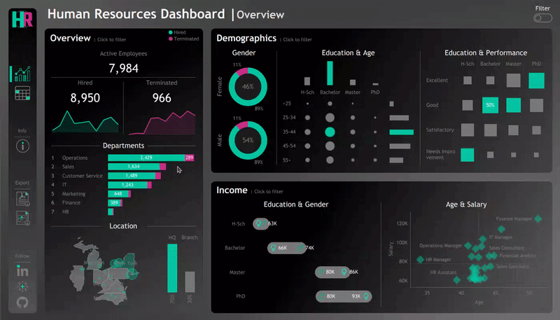

# Tableau HR Dashboard Project

Welcome to the **Tableau HR Dashboard Project** repository! 🚀  
This project contains two interactive views (**Summary View** and **Records View**) built with **Tableau** to analyze human resources data.

🎥 **Live Preview of Dashboards:**



> 🔗 **Interactive Dashboards on Tableau Public:**  
> [View and interact with the dashboards online](https://public.tableau.com/views/HR-Dashboard_17815972182420/HRSummary?:language=en-US&:sid=&:redirect=auth&:display_count=n&:origin=viz_share_link) 

---

## 📖 Project Overview

This project focuses on delivering actionable insights for HR managers through two linked views:

- **Summary View**: Provides a snapshot of overall HR metrics across three sections: Overview (KPIs, trends, department breakdown), Demographics (gender ratio, age groups, education, performance correlation), and Income Analysis (salary by education/gender, age-salary correlation by department).
- **Records View**: Offers a comprehensive, filterable list of all employees with details such as name, department, position, gender, age, education, and salary.

Both views are **interactive** and include **filters** for dynamic data exploration.

---

## 🎯 Requirements

The dashboards were built based on a detailed user story covering KPIs, demographics, income analysis, and employee records.

📄 **Full user story available here:** [docs/user-story.md](docs/user-story.md)

---

## 📂 Repository Structure
```
tableau-hr-dashboard-project/
│
├── assets/
│ ├── icons/                   # Icons used in the dashboards
│ ├── images/                  # Background images for each view
│ ├── mockups/                 # Design and container mockups
│ └── dashboard-preview.gif    # Animated preview of dashboards
│
├── datasets/                  # CSV file used in the dashboards
│
├── docs/
│ └── user-story.md            # Complete requirements specification
│
├── HR-Dashboard.twbx          # Packaged Tableau workbook
├── LICENSE                    # License information for the repository
└── README.md                  # Project overview and instructions
```

---

## 🙏 Acknowledgements

Thanks to [@datawithbaraa](https://www.youtube.com/@datawithbaraa) on YouTube for teaching me how to build these dashboards.

---

## 🛡️ License

This project is licensed under the [MIT License](LICENSE). You are free to use, modify, and share this project with proper attribution.

---

## 👨🏻‍💻 About Me

Hi there! I'm **Omid Zolfagahr Beigy**. I’m passionate about problem-solving and optimizing systems to enhance efficiency and performance. My core strengths lie in systems optimization, supported by skills in mathematical programming, data analysis, and machine learning.

Let's stay in touch! Feel free to connect with me on the following platforms:

[](https://linkedin.com/in/omidzbeigy)
[](https://public.tableau.com/app/profile/omid.zolfaghar.beigy/vizzes)
